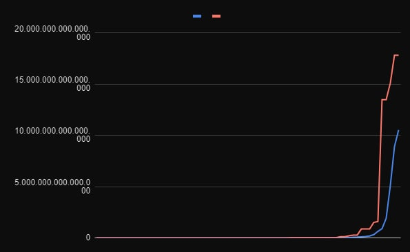
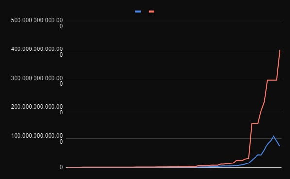
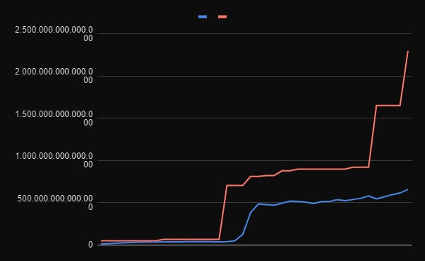

# Worlds-Hardest-Game-GA
O Jogo consiste de um jogador representado por um quadrado que tem que descobrir um caminho para conseguir pegar a moeda e chegar na saída.

# Projeto

O JOGO MAIS DIFICIL DO MUNDO - UMA ABORDAGEM EVOLUTIVA

Nosso projeto consiste em um algoritmo evolutivo, apoiado por diferentes técnicas
de otimização de desempenho, para jogar o Jogo Mais Dificil do Mundo, sucesso nos
anos 2000. O AE (sigla para algoritmo evolutivo, como passaremos a chamá-lo a partir de agora)
foi baseado em 4 técnicas distintas:
 
predação simples, que elimina o pior indivíduo da população
e insere um novo completamente divergente, a fim de gerar diversidade e lapidar possíveis
indivíduos atrasados no curso da evolução;

reprodução assexuada ou clonagem, que como o próprio nome sugere, multiplica um indivíduo ou
uma parcela da população promovendo a convergência dos resultados;

mutação variável, uma técnica de adaptação inteligente que se baseia no histórico de 
melhoria do melhor indivíduo presente na população para gerar um incremento ou decremento
da taxa de mutação, a fim de extrair o melhor de uma população em estado de diversidade e
em estado de convergência

evolução incremental, ou "um passo de cada vez", como enxerga este que vos escreve. Reduz
o problema incialmente a um passo base e, a partir daí, a evolução é escalada, concentrando
o foco do algoritmo etapa a etapa e gerando um desenvolvimento coeso ao longo da execução.  
 
Com essas técnicas e nosso raciocínio aplicado nos ajustes necessários, o algoritmo conseguiu
completar os 3 níveis sem muitos problemas, com indivíduos bons antes da geração 150 e com 
um número eficiente de movimentos.

Os conhecimentos obtidos ao longo da disciplina foram muito úteis para aprender a pensar 
fora do escopo tradicional de programação e resolução de problemas, além de gerar uma
simpatia pela área da inteligência artificial. Esperamos que apreciem o trabalho!

Créditos pela arquitetura do jogo:  [Code Bullet](https://github.com/Code-Bullet/WorldsHardestGameAI)

# Video
O Link do vídeo com a explicação do projeto está [aqui.](https://youtu.be/RT5sD69Gx3c)

# Gráficos Gerados com os Fitness do melhor jogador e da média dos Fitness da População

A linha em vermelho representa o fitness do melhor jogador.
E a linha em azul a média dos fitness dos jogadores.

---
### Nível 1 com Predação Aleatória e Mutação Variável

---
### Nível 2 com Predação Aleatória e Mutação Variável

---

### Nível 3 com Predação Aleatória e Mutação Constante

---